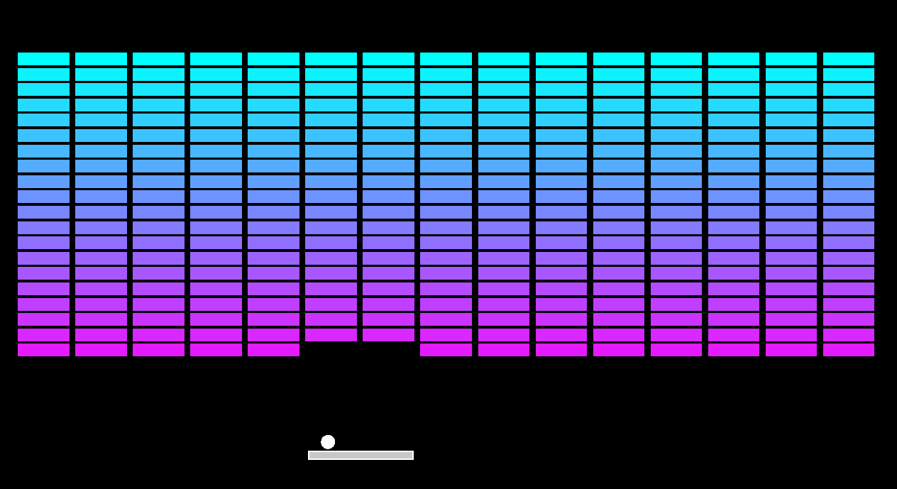

# Breakout

## Description
This is a C++ game project which aims to recreate the classic Atari game, Breakout.    

## Requirements 
* C++20
* SFML library
* Visual studio 2022 (with Game Development with C++ enabled)

Refer to the page below to better understand how to set up your environment.

[`SFML Visual Studio Setup Tutorial`](https://www.sfml-dev.org/tutorials/2.6/start-vc.php)

## Images

## How to Play

Install the Breakout.exe file from my repository and run it.

* **Left arrow key** : Move left      
* **Right arrow key** : Move right   
* **R key** : Reset game   
* **P key** : Pause game    

